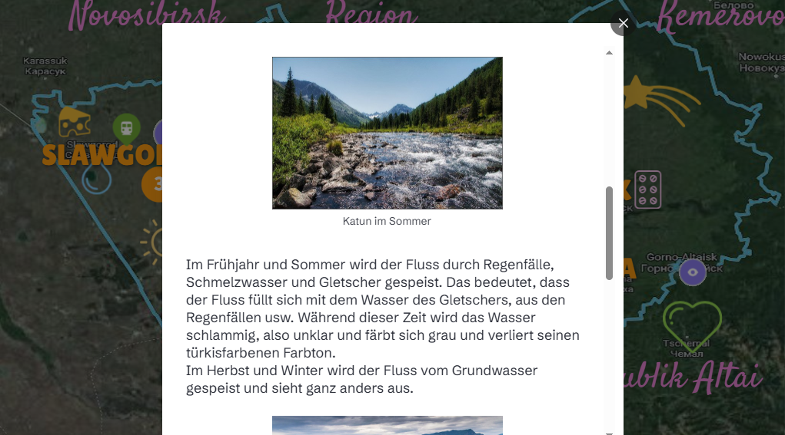

# ID Milla

Welcome! I'm an instructional designer focused on minimal, learner-centered content. This portfolio features samples of interactive modules, visual maps, and hand-drawn learning aids.

---

## 🎓 Featured Projects

### 🧩 Interactive Course with gamification and sound (iSpring)

- **Tool**: iSpring Max Suite
- Press play or open in a new window:
  
 

- Description: A basics birding course designed for young nature-guides and nature-lovers.

---

### 🎞️ An inclusive Math-course with AI-voiceover 

- **Tool**: iSpring Max Suite + PowerPoint
- **Link**: [View Project](https://yourlink.com)
- Description: A course on matrixes for mathematical classes - multiple level's quest.

---

### 📊 Presentation — "Digital economy of SCO member states"
- **Tool**: Prezi
- **Link**: [View online](https://prezi.com/view/UlYX7xNZB0Go7F6R0Ct9/)
- Description: A slide deck designed for an international relations lecture.

---

## 🗺️ Interaction Map in German/Russian

- An interaction map showing learner geography and highlights of a region.

---

## ✍️ Visual Sketches

Hand-drawn instructional illustrations supporting cognitive load management.

  

---

## 🔗 Infographic design
Infographic for Galaxy Tool and Genes analysis
- **Tool**: PowerPoint + Adobe Photoshop
- **Link**: [View project](https://drive.google.com/file/d/1xI38q3h2aRx2UUlwxut7Z9xl90nJ2KUU/view?usp=sharing)
  
  
---

## 📬 Contact

Want to collaborate or learn more? Reach me at **yourpaths1@gmail.com**
